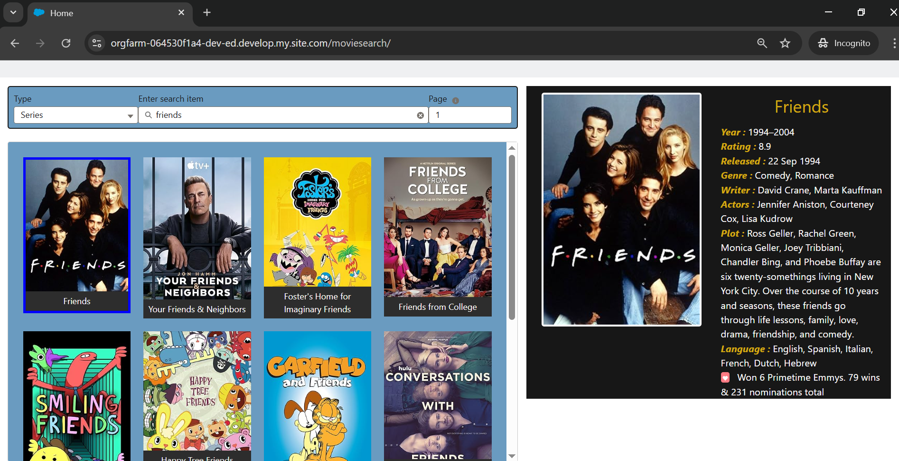

# 🎬 Movie Search LWC App

This is a Lightning Web Component (LWC) project built on the Salesforce platform that allows users to search for movies and TV series using the [OMDb API](http://www.omdbapi.com/).

> 🔐 Note: This repo contains only core components. All development and testing were done in a private Salesforce org.

---
## 🌐 Live Demo

🧪 **Check it out here:**  
👉 [(https://orgfarm-064530f1a4-dev-ed.develop.my.site.com/moviesearch/)](https://orgfarm-064530f1a4-dev-ed.develop.my.site.com/moviesearch/)

> ℹ️ *This is a public-facing LWR site deployed from Salesforce Experience Cloud.*

---

## 📸 Screenshots

## 📌 Features

- 🔍 Debounced search input to reduce API calls
- 🎞️ Filter by type (Movie, Series, etc.)
- 📄 Paginated results
- 🔄 Dynamic UI with real-time input handling
- 🔃 Communication between components
- ⚡ External API integration via Apex callout

---

## 💻 Technologies Used

- ⚙️ Salesforce Lightning Web Components (LWC)
- 📡 OMDb API (Open Movie Database)
- 🧪 Salesforce Developer Org
